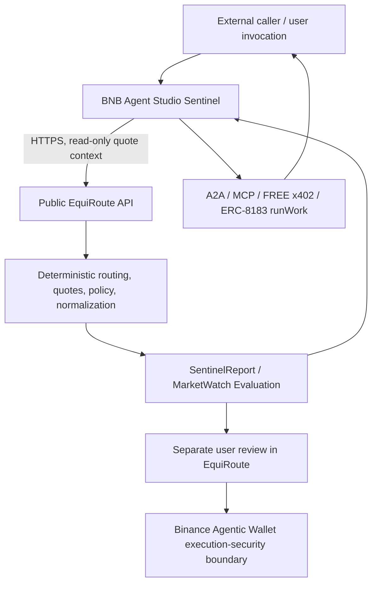

# EquiRoute Sentinel

**Autonomous market-watch intelligence for EquiRoute.**

EquiRoute Sentinel is a BNB Agent Studio agent that invokes EquiRoute over HTTPS, evaluates deterministic tokenized-equity MarketWatch conditions, and returns structured, auditable reports through A2A, MCP, FREE x402, and ERC-8183-compatible work delivery.

**EquiRoute remains the financial decision authority. Sentinel never independently selects routes and never authorizes trades.** A MarketWatch match means an interesting condition was observed—not permission to trade.

## Why Sentinel Exists

The system keeps analysis and execution responsibilities separate:

**EquiRoute** is the deterministic financial decision engine. It owns:

- Canonical tokenized-equity representation discovery
- Live provider quotes and normalization
- Expected output and underlying exposure
- Market regime and deterministic mandate evaluation
- Route selection and simulation

**EquiRoute Sentinel** is the autonomous analysis and orchestration layer. It:

- Requests current analysis from EquiRoute over HTTPS
- Evaluates user-defined MarketWatch conditions with fixed code
- Explains—but cannot alter—the deterministic result
- Exposes one-off analysis and watch evaluation through agent interfaces
- Produces structured Sentinel Reports and deliverables

**Binance Agentic Wallet** is a separate user-review/execution-security boundary. Sentinel does not call it. The Studio wallet and Binance Agentic Wallet are not integrated or interchangeable. If the user later chooses to act, execution review happens separately in EquiRoute.

## Architecture



The Sentinel’s configured quote-context address is used only where an EquiRoute RFQ needs a public address to return a quote. It is not a signer, execution wallet, or authorization. The separate Studio signer is not used by the autonomous Sentinel analysis/watch path.

## MarketWatch

A versioned MarketWatch is evaluated **whenever invoked**. Studio v1 does not provide a continuous native scheduler or background polling service.

Conditions supported by deterministic Sentinel Report fields include:

- Selected provider equals a requested provider (for example, `bstock`)
- Provider availability (for example, require `xstock` to be executable)
- Effective USD/share at or below a decimal threshold
- Normalized underlying shares at or above a decimal threshold
- Market regime belongs to an allowed set
- Policy outcome is `allowed` or `confirmation_required`
- Minimum count of eligible executable alternatives

Decimal thresholds are compared as decimal strings without binary floating-point rounding. Provider liquidity failure, policy exclusion, and missing/technical quote failure remain distinct report outcomes.

### Example watch

```json
{
  "version": "1",
  "ticker": "NVDA",
  "notionalUsd": "10",
  "slippagePercent": "0.5",
  "conditions": {
    "providerAvailability": {
      "provider": "xstock",
      "required": true
    }
  }
}
```

This watch is evaluated on each invocation. If xStock has no executable liquidity at that time, the deterministic condition is false and the upstream reason is preserved.

A match is informational only. Every evaluation/report states:

```text
authorization: "none"
requiresUserReviewInEquiRoute: true
```

## Agent Interfaces

### A2A

The AgentCard advertises:

- `analyze_tokenized_equity` — one-off tokenized-equity analysis
- `evaluate_market_watch` — one-off deterministic MarketWatch evaluation
- ERC-8183 seller operations `negotiate` and `notify_funded` when the commerce rail is configured

MarketWatch is evaluated whenever invoked, not continuously scheduled.

### MCP

The MCP face exposes these Sentinel tools:

- `analyze_tokenized_equity`
- `evaluate_market_watch`

Both are annotated read-only (`readOnlyHint: true`). No trading, wallet-spend, or signing tool is exposed to the LLM.

### x402

The configured seller price is `$0`, so `/x402` uses FREE passthrough. B402 paid merchant credentials and wallet payments are not required for the current demo; no payment occurs on the Sentinel path.

### ERC-8183-compatible delivery

The existing Studio seller protocol remains bounded:

1. `negotiate`
2. Buyer creates and funds a job
3. `notify_funded`
4. `runWork`
5. Deliverable

For a Sentinel MarketWatch job, `runWork` can produce this structured deliverable shape:

```json
{
  "kind": "equiroute_market_watch",
  "watch": {},
  "evaluation": {},
  "authorization": "none"
}
```

This documents the implementation shape only. No funded on-chain job is claimed to have been executed as part of this project validation.

## ERC-8004 Identity

BNB Agent Studio can register/reconcile the deployed agent identity on BSC testnet during deployment verification (`bag deploy verify`). **No ERC-8004 identity is currently registered for this workspace**, and no agent ID is claimed here. Registration has not been performed.

## Deterministic Safety Boundary

- EquiRoute selects the route; the LLM does not.
- Fixed code evaluates MarketWatch conditions; the LLM cannot change `matched`.
- Decimal conditions use exact decimal-safe comparisons.
- LLM commentary is supplemental only. Reasoning-tagged, meta/prompt-leaking, excessive, or numerically unsupported commentary is discarded in favor of deterministic text.
- Sentinel does not call Binance Agentic Wallet endpoints or `/api/prepare`.
- Sentinel analysis/watch does not sign, trade, broadcast, or create an executable transaction.
- Every Sentinel report/evaluation has authorization `none` and requires EquiRoute user review.

## Quote Context

`EQUIROUTE_QUOTE_WALLET_ADDRESS` is a public EVM address used only as read-only RFQ quote context when EquiRoute needs an address to produce a quote. It is **not** an execution wallet, signer, Binance Agentic Wallet identity, or execution authorization. The value is server-side configuration, not accepted from a caller request.

## Public EquiRoute Dependency

Configure the server-side base URL with:

```text
EQUIROUTE_BASE_URL=https://equiroute-lime.vercel.app
```

Deployed/production mode requires an HTTPS URL and rejects localhost/loopback. Local development may use `http://localhost:3000`. If the public EquiRoute dependency is missing, misconfigured, unreachable, or returns invalid data, Sentinel fails closed and does not fabricate a route, policy result, or watch match.

The health/readiness helper validates configuration without issuing a market-routing request. Endpoint readiness remains unknown until a real validated Sentinel request; generic health checks do not trigger market/RFQ provider calls.

## Tech Stack

- BNB Agent Studio CLI/runtime (`bag`; project prepared for AgentCore)
- TypeScript and Node.js 22+
- AI SDK (supplemental explanation only; deterministic watch/report logic is fixed code)
- A2A and Model Context Protocol (MCP)
- x402 FREE passthrough
- ERC-8183 seller-compatible delivery and ERC-8004 deployment identity workflow
- EquiRoute HTTPS API
- BNB Smart Chain testnet (`bsc-testnet`)

## BNB Agent Studio Integration

Current workspace configuration (`app/agent/studio.toml`):

- Runtime: AgentCore
- Destination: BNB managed platform
- Protocols: A2A, MCP, X402
- Network: `bsc-testnet`
- Wallet kind: `evm-local`, throwaway testnet wallet
- LLM: `auto/free` via the configured Pieverse provider
- Seller pricing: FREE (`price_usd = "0"`)
- Auto-topup: disabled
- Deliverable storage: local for development; managed platform storage is used for the managed deployment target

The encrypted keystore and local secret environment file under `.studio/` are local-only and ignored by Git. Do not commit them. Studio sends wallet material only through its documented runtime-secret channel as part of an explicitly authorized deployment; it is never included in this README or the source artifact.

## Local Development

Prerequisites: Node.js 22+, pnpm, and the BNB Agent Studio CLI (`bag`). The installed project guidance requires Studio CLI `0.0.13+`; this workspace was validated with `0.0.14`.

From the workspace root:

```bash
pnpm install
# Configure local values in the local secret environment file; never put secrets on argv.
# Local EquiRoute: EQUIROUTE_BASE_URL=http://localhost:3000
# Public EquiRoute: EQUIROUTE_BASE_URL=https://equiroute-lime.vercel.app
bag doctor
bag dev
```

Studio automatically loads the local secret environment file. The agent serves A2A and tunneled MCP locally; check the AgentCard at `http://localhost:9000/.well-known/agent-card.json`. Start EquiRoute separately if using the local URL.

Useful project checks, from `app/agent/`:

```bash
pnpm test
pnpm typecheck
pnpm build
```

## Environment Variables

Configure values locally in the ignored Studio secret environment file or through Studio’s documented managed runtime configuration. Never commit that file.

| Variable | Purpose | Secret? |
|---|---|---:|
| `EQUIROUTE_BASE_URL` | EquiRoute API base URL; HTTPS required in deployed mode | No |
| `EQUIROUTE_QUOTE_WALLET_ADDRESS` | Public, read-only RFQ quote context | No |
| `EQUIROUTE_TIMEOUT_MS` | Optional request timeout override | No |
| `EQUIROUTE_API_TOKEN` | Optional future API token seam; not currently required | Yes, if configured |
| `wallet unlock password` | Local encrypted Studio keystore unlock | Yes; never publish |
| `PIEVERSE_LLM_API_KEY` | Studio/Pieverse runtime credential | Yes; never publish |

Do not include wallet passwords, keystore contents, API keys, B402 credentials, or private keys in examples, source, screenshots, logs, or commits.

## Testing

```bash
cd app/agent
pnpm test
pnpm typecheck
pnpm build
cd ../..
bag doctor
git diff --check
```

The tests cover EquiRoute HTTP resilience/schema validation, deterministic route/report preservation, MarketWatch condition matching and decimal-safe comparisons, A2A and MCP surfaces, execution-boundary blocklists, LLM commentary safeguards, wallet/signing boundaries, and zero-price x402 behavior.

## Deployment (not performed)

The intended BNB managed-platform preparation/deployment flow is:

```bash
bag deploy prepare --provider bnb --backend aws
bag deploy --provider bnb
bag deploy status
bag deploy verify --provider bnb
```

**This repository has not been deployed by this documentation pass.** The BNB managed-platform trial is time-limited; its 48-hour clock starts on the first successful `bag deploy --provider bnb`. Read the current BNB Agent Studio guidance and review all readiness warnings before any deployment. A public HTTPS EquiRoute URL must be configured before deploying the Sentinel.

## Screenshots

Screenshot slots are reserved under [`docs/images/`](docs/images/README.md). No screenshots are included yet; add authentic captures of local analysis, MarketWatch output, A2A/MCP proof, and deployed Agent Studio status only when those states have actually been observed. Never include secrets or wallet material in captures.

## Main EquiRoute Repository

TODO: add the verified public URL for the main EquiRoute repository. No repository URL was configured in this workspace, so one is intentionally not guessed.

## Security and Disclaimer

Hackathon/research software; provided for demonstration and testing. It is not financial advice and does not trade automatically. MarketWatch matches are informational observations, not trade signals or execution approvals. Real execution remains behind separate user review and security controls in EquiRoute. Never expose wallet secrets or use a funded/mainnet wallet for local experiments.

## License

No license file or license metadata is present in this repository. All rights remain with the respective authors; reuse and redistribution permissions have not been specified.
